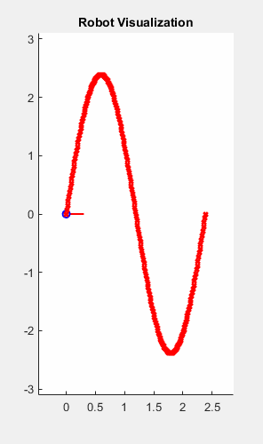

# Human Path Following MPC Control 
In this project, a differential drive mobile robot is controlled to follow a human path using Model Predictive Control (MPC). The optimization problem within the MPC framework is solved using [CasADi](https://web.casadi.org/), a symbolic framework for automatic differentiation and numerical optimization. This project contains two implementation versions, one in MATLAB and one in Python.

## Prerequisites
### MATLAB 
In the MATLAB implementation, the mobile robot is simulated using the [Mobile Robotics Simulation Toolbox](https://de.mathworks.com/matlabcentral/fileexchange/66586-mobile-robotics-simulation-toolbox) developed by [Mathworks](https://de.mathworks.com/).

Before running the code, ensure you have the following:
1. **[Mobile Robotics Simulation Toolbox](https://de.mathworks.com/matlabcentral/fileexchange/66586-mobile-robotics-simulation-toolbox)**: This toolbox is essential for the simulation. You can install it from the MATLAB Central File Exchange.

2. **CasADi Package**: Download the latest version of CasADi from here: https://web.casadi.org/get/ (this project was tested with casadi-3.6.5). Once downloaded, extract the package and place it in the root directory of the project.

### Python

The following packages are required for the implementation in Python:
````
python -m pip install -U pip 
pip install casadi
pip install numpy
python -m pip install matplotlib
python -m pip install scipy
````
   
## Simulation Example


## Source
The MPC implementation in this project was inspired by the workshop [MPC and MHE implementation in Matlab using Casadi](https://www.youtube.com/watch?v=RrnkPrcpyEA).

